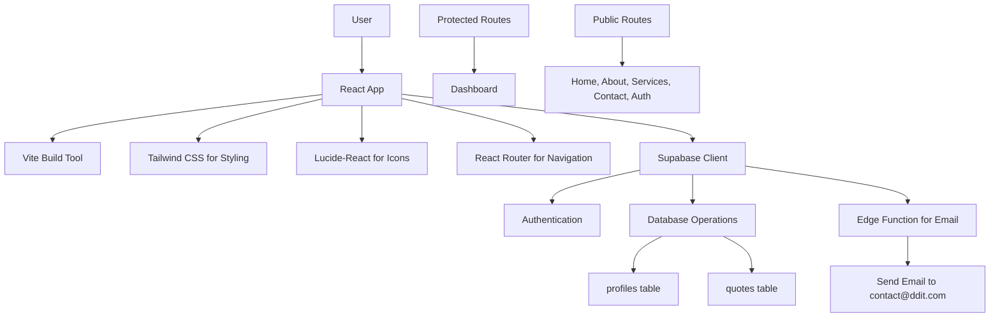

# DDIT Website Project Plan

## Overview

Build a professional website for Double Digit IT Solutions (DDIT) using React, TypeScript, Vite, Tailwind CSS, Lucide-React, and Supabase. The site will include authentication, quote submission, and email notifications. The website will be modern, tech-focused, with high trust elements like rounded corners and subtle shadows. Color palette: Primary Blue (#2D5BFF), Secondary Green (#00E676), clean white/off-white background.

## Tech Stack

- Frontend: React (Vite), TypeScript, Tailwind CSS
- Icons: Lucide-React
- Backend/Auth: Supabase
- Email: Supabase Edge Function
- Routing: React Router DOM

## Pages

1. **Home**: Hero section with compelling headline, "Get a Quote" CTA button, brief services overview, value proposition highlighting expertise in SaaS, Web Design, CAC Registration, and IT Consultancy.
2. **About Us**: Company mission, expertise areas, team introduction (if applicable), trust-building elements.
3. **Services**: Detailed cards for each service: SaaS Development (description, benefits), Web Design (portfolio examples if possible), CAC Registration (process), IT Services (consultancy details).
4. **Auth Pages**: Login and Sign-up forms using Supabase Auth, with email/password fields, error handling.
5. **Dashboard/Quote Area**: Protected route accessible after login. Contains a detailed quote request form with fields: service_type (dropdown), description (textarea), budget_range (select), submit button. Displays user's previous quotes if any.
6. **Contact**: Contact form (name, email, message), company location, social media links, phone number.

## Database Schema (Supabase)

- **profiles**: Linked to auth.users via user_id (uuid). Fields: id (uuid, primary), user_id (uuid, foreign key), full_name (text), created_at (timestamp).
- **quotes**: Fields: id (uuid, primary), user_id (uuid, foreign key to profiles), service_type (text, e.g., 'SaaS', 'Web Design'), description (text), budget_range (text, e.g., '$1k-$5k'), status (text, default 'pending'), created_at (timestamp).

## Architecture Diagram

## Functional Requirements

- **Authentication**: Users must sign up/login to access the quote request form. Use Supabase Auth for secure user management.
- **Quote Submission**: Form validation on client-side. On submit, insert into quotes table, then invoke Edge Function to send email notification to contact@ddit.com with quote details.
- **Responsive Design**: Use Tailwind's responsive utilities to ensure optimal display on mobile (sm), tablet (md), and desktop (lg+).
- **Navigation**: Sticky header with logo, navigation links (Home, About, Services, Contact), active link highlighting, "Get a Quote" CTA button that redirects to login if not authenticated, or to dashboard if logged in.
- **Additional Features**: Loading states, error handling, success messages for forms. SEO-friendly meta tags. Accessibility considerations (alt texts, keyboard navigation).

## Folder Structure Outline

- src/
  - components/ (reusable components like Header, Footer, ServiceCard)
  - pages/ (Home.tsx, About.tsx, Services.tsx, Login.tsx, Signup.tsx, Dashboard.tsx, Contact.tsx)
  - hooks/ (useAuth.ts for auth state)
  - utils/ (supabaseClient.ts)
  - App.tsx (routing setup)
  - main.tsx (entry point)
- public/ (static assets)
- supabase/ (Edge Functions for email)
